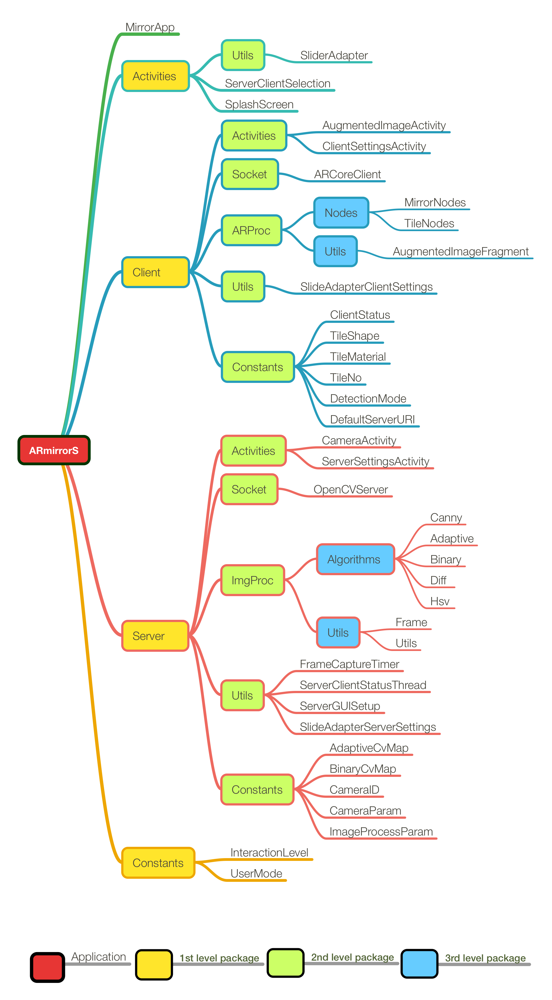

------


> ## **Table of Contents**
- [ARmirrorS Project](#armirrors-project)
  * [Project Synopsis](#project-synopsis)
  * [Project Description](#project-description)
  * [Dependencies - API's & SW Libraries](#dependencies---api-s---sw-libraries)
  * [Installation](#installation)
- [Package Structure](#package-structure)
  * [Client Side Flow Diagram](#client-side-flow-diagram)
  * [Server Side Flow Diagram](#server-side-flow-diagram)
- [Documentation](#documentation)
- [Contributions](#contributions)
- [Team](#team)


## ARmirrorS Project

This is the final project for Introductory course to Computer Science at [university of Illinois](https://illinois.edu/) Urbana-Champagne [CS125](https://cs125.cs.illinois.edu/). The goal was to build an android complete app with a simple UI design implementing API's, software libraries and new android features not discussed in Class or Lab.

[](https://www.youtube.com/watch?v=rP-6eG4nIIU)


### Project Synopsis

------

Project was inspired by work of Daniel Rozin. Rozin is an Associate Arts Professor at[ NYU](http://itp.nyu.edu/). He is working in the area of [interactive digital art](https://en.wikipedia.org/wiki/Interactive_art). As an interactive artist Rozin creates installations and sculptures that have the unique ability to change and respond to the presence and point of view of the viewer. 

[](https://www.youtube.com/watch?v=Wb6eFGbwPeA)

The main idea of the project was to replicate one of his creations: namely [the Wooden Mirror - 1999](http://www.smoothware.com/danny/woodenmirror.html), using Android Studio Development environment and Java code only.

Daniel Rozin's art pieces are represented by Bitforms gallery 529 West 20 St. New York


### Project Description

------

To accomplish this task. The project attempts to use multiple Libraries and API's integrating them in a single application distribution with two flavors. 

- One may run the app as a Server which attempts to extract the foreground from the background through different algorithms using OpenCV library for computer vision, and send the processed masked frames using WebSocket API to a different phone for viewing.  
- A second option would be to run the application as a client in which the user is able to select Tile mirror size, material, and shapes and using Augmented Reality API provided by Google ARCore in conjunction with SceneForm render the models in an AR session and rotate the tiles processed by the server on every frame update.

`**For complete JavaDocs of version 1.1 please` [follow this link](https://ykhalil2.github.io/ARmirrorS/JavaDocs/).**


### Dependencies - API's & SW Libraries

------

> The following dependencies should be included in the project build.gradle file. 
>
> ```java
> dependencies {    
>     implementation 'org.java-websocket:Java-WebSocket:1.4.0'
>     implementation 'com.google.android.material:material:1.0.0'
>     implementation 'com.google.ar.sceneform.ux:sceneform-ux:1.13.0'
> }
> ```
>
> Main API's and Libraries used in the project are:
>
> 1. Java-[WebSocket](https://github.com/TooTallNate/Java-WebSocket) API version 1.4.0 for interaction between 
> 2. Google [SceneForm](https://developers.google.com/ar/develop/java/sceneform) API version 1.13.0 for realistic 3D mirror frame and tile rendering.
> 3. Google [ARCore](https://developers.google.com/ar/reference/java/) API for augmented reality Client Feature.
> 4. addition [OpenCV Library](https://opencv.org/) version 4.1.1


The application implements the following Android Features as well

1. [ViewPager](https://developer.android.com/reference/android/support/v4/view/ViewPager) as a layout manager to allow user to flip let and right through different activities.
2. [Menu](https://developer.android.com/reference/android/view/Menu) of actions and options.
3. [Toolbar](https://developer.android.com/training/appbar/setting-up) instead of regular application bar to have more screen room to display all parameters associated with different foreground extraction methods for processing the frames by the server.
4. [Thread](https://developer.android.com/reference/java/lang/Thread) and [Timers](https://developer.android.com/reference/android/os/CountDownTimer), running in the background for multiple tasks such as updating client and server status on the main activity UI thread, etc.
5. Fade [animations](https://developer.android.com/training/animation/overview) for splash screen.

And many other features.


### Installation

------

Other than adding the previously mentioned module dependencies in the application gradle file, the tricky part is getting the OpenCV to run in android studio environment.

**1.** Make sure you have Android SDK up to date, with NDK installed

**2.** Download latest OpenCV SDK for Android from OpenCV.org and decompress the zip file.

**3.** Create a new Android Studio project

- Check Include C++ Support
- Choose empty Activity
- In C++ Support, you can check -fexceptions and -frtti

**4.** Import OpenCV library module

- New -> Import Module
- Choose the YOUR_OPENCV_SDK/sdk/java folder
- Uncheck replace jar, uncheck replace lib, uncheck create gradle-style

**5.** Set the OpenCV library module up to fit your SDK

Edit openCVLibrary/build.gradle to match your app/build.gradle:

```
compileSdkVersion 28
	defaultConfig {
	minSdkVersion 19
	targetSdkVersion 28
}
```

**6.** Add OpenCV module dependency in your app module

File -> Project structure -> Module app -> Dependencies tab -> New module dependency -> choose OpenCV library module

**7.** Make a **jni** folder by right clicking on **app/src/main** and click **change folder** box after that rename folder from **jni** to **jniLibs**

**8.** Copy all files from your OpenCV directory ***YOUR_OPENCV_SDK/sdk/native/libs\*** that you have downloaded and paste them in **jniLibs** folder

**9.** Set the app build.gradle

- Add abiFilters

  ```
  externalNativeBuild {
  cmake {
      cppFlags "-frtti -fexceptions"
      abiFilters 'x86', 'x86_64', 'armeabi-v7a', 'arm64-v8a'
     }
  }
  ```

> This procedure was provided by [Muhammad Yasir](https://stackoverflow.com/users/9885287/muhammad-yasir) on [StackOverflow](https://stackoverflow.com/questions/50425576/opencv-on-android-studio?answertab=active#tab-top).`


## Package Structure

Following graph shows the package structure of the ARmirrorS app. Note, there is only one distribution for client and server packaged in one app but never internally interact and run as totally different apps. 



The server main task is to process each camera frame and try to isolate the foreground from the background by superimposing a mask to be sent to the client with normalized rotation angles for each of the tiles. Different Background subtraction algorithms, and color thresholding techniques are implemented including but not limited to

- HSV Thresholding

- Binary Thresholding

- Adaptive Thresholding

- Background Subtraction (MOG2, KNN, and frame difference algorithms)

  

> **Example:**
>
> ------
>
> The following processed mask was downscaled to match the tile resolution requested by the user, in the processes pixelating the mask to (32x32 pixel size) and the resulting downscaled mask after being applied to the original frame capture can be seen below:
>
> 
>
> 
>
  00,00,00,00,00,00,00,00,00,00,00,00,00,00,00,00,00,00,00,00,00,00,00,00,00,00,00,00,00,00,00,00;
  00,00,00,00,00,00,00,00,00,00,00,00,00,00,00,00,00,00,00,00,00,00,00,00,00,00,00,00,00,00,00,00;
  00,00,00,00,00,00,11,11,00,00,00,00,00,11,11,00,00,00,00,00,00,00,00,00,00,00,00,00,00,00,00,00;
  00,00,00,00,00,00,11,11,11,00,00,00,11,11,11,00,00,00,00,00,00,00,00,00,00,00,00,00,00,00,00,00;
  00,00,00,00,00,00,11,11,11,11,00,00,00,11,11,11,00,00,00,00,00,00,00,00,00,00,00,00,00,00,00,00;
  00,00,00,00,00,00,00,11,11,11,00,00,00,11,11,11,00,00,00,00,00,00,00,00,00,00,00,00,00,00,00,00;
  00,00,11,11,11,00,00,00,11,11,11,00,00,00,11,11,11,00,00,00,00,00,00,00,00,00,00,00,00,00,00,00;
  00,00,11,11,11,11,00,00,11,11,11,11,00,00,11,11,11,00,00,00,00,00,00,00,00,00,00,00,00,00,00,00;
  00,00,00,11,11,11,00,00,00,11,11,11,00,00,11,11,11,11,00,00,00,00,00,00,00,00,00,00,00,00,00,00;
  00,00,00,11,11,11,11,00,00,11,11,11,11,00,00,11,11,11,00,00,00,00,00,00,00,00,00,00,00,00,00,00;
  00,00,00,00,11,11,11,11,00,00,11,11,11,11,00,11,11,11,00,00,00,00,00,00,00,00,00,00,00,00,00,00;
  00,00,00,00,00,11,11,11,11,00,11,11,11,11,00,11,11,11,00,00,00,00,00,00,00,00,00,11,11,11,11,11;
  00,00,00,00,00,00,11,11,11,11,00,11,11,11,00,11,11,11,11,00,00,00,00,00,00,00,11,11,11,11,11,00;
  00,00,00,00,00,00,11,11,11,11,00,00,11,11,11,11,11,11,11,00,00,00,00,00,00,00,11,11,11,11,00,00;
  11,00,00,00,00,00,00,11,11,11,11,00,11,11,11,11,11,11,11,11,00,00,00,00,00,11,11,11,11,00,00,00;
  11,11,11,00,00,00,00,00,11,11,11,11,11,11,11,11,11,11,11,11,00,00,00,00,00,11,11,11,11,00,00,00;
  11,11,11,11,11,00,00,00,00,11,11,11,11,11,11,11,11,11,11,11,11,11,00,00,11,11,11,11,00,00,00,00;
  00,11,11,11,11,11,11,00,00,11,11,11,11,11,11,11,11,11,11,11,11,11,11,11,11,11,11,11,00,00,00,00;
  00,00,00,11,11,11,11,11,11,11,11,11,11,11,11,11,11,11,11,11,11,11,11,11,11,11,11,11,00,00,00,00;
  00,00,00,00,11,11,11,11,11,11,11,11,11,11,11,11,11,11,11,11,11,11,11,11,11,11,11,11,00,00,00,00;
  00,00,00,00,00,00,11,11,11,11,11,11,11,11,11,11,11,11,11,11,11,11,11,11,11,11,11,00,00,00,00,00;
  00,00,00,00,00,00,00,11,11,11,11,11,11,11,11,11,11,11,11,11,11,11,11,11,11,11,00,00,00,00,00,00;
  00,00,00,00,00,00,00,00,11,11,11,11,11,11,11,11,11,11,11,11,11,11,11,11,11,11,00,00,00,00,00,00;
  00,00,00,00,00,00,00,00,00,11,11,11,11,11,11,11,11,11,11,11,11,11,11,11,11,00,00,00,00,00,00,00;
  00,00,00,00,00,00,00,00,00,00,11,11,11,11,11,11,11,11,11,11,11,11,11,11,00,00,00,00,00,00,00,00;
  00,00,00,00,00,00,00,00,00,00,11,11,11,11,11,11,11,11,11,11,11,11,11,11,00,00,00,00,00,00,00,00;
  00,00,00,00,00,00,00,00,00,00,00,11,11,11,11,11,11,11,11,11,11,11,11,11,00,00,00,00,00,00,00,00;
  00,00,00,00,00,00,00,00,00,00,00,00,11,11,11,11,11,11,11,11,11,11,11,11,11,00,00,00,00,00,00,00;
  00,00,00,00,00,00,00,00,00,00,00,00,00,11,11,11,11,11,11,11,11,11,00,11,00,00,00,00,00,00,00,00;
  00,00,00,00,00,00,00,00,00,00,00,00,00,00,11,11,11,11,11,11,11,11,11,11,00,11,00,00,00,00,00,00;
  00,00,00,00,00,00,00,00,00,00,00,00,00,00,00,11,11,11,11,11,11,11,11,00,00,11,00,00,11,11,00,00;
  00,00,00,00,00,00,00,00,00,00,00,00,00,00,00,11,11,11,11,11,11,11,11,00,00,11,00,00,11,11,00,00;
  00,00,00,00,00,00,00,00,00,00,00,00,00,00,00,11,11,11,11,11,11,11,11,00,00,11,00,00,11,11,00,00;
  00,00,00,00,11,11,00,00,11,11,00,00,00,00,00,11,11,11,11,11,11,11,11,11,11,11,00,00,00,00,00,00;

They byte buffer array that contains the rotation angles is sent to the client for rendering which will be handled by AR Core and Scene Form API's.


### Client Side Flow Diagram

------

Following diagram demonstrates the flow structure of the client side of the application from application launch until tiles rotation.


### Server Side Flow Diagram

------

Following diagram demonstrates the flow structure of the server side of the application from application launch until tiles rotation.


## Documentation 

[JavaDocs](https://ykhalil2.github.io/ARmirrorS/JavaDocs/) of version 1.1 of the project can be found at the following link.

 


## Contributions

1. Fork it!
2. Create your feature branch: `git checkout -b my-new-feature`
3. Commit your changes: `git commit -am 'Add some feature'`
4. Push to the branch: `git push origin my-new-feature`
5. Submit a pull request 


## Team

work on the final project was completed by 

```java
* @author Yussuf Khalil
          ykhalil2@illinois.edu
          
  @author Daniel King
          dking32@illinois.edu *
```

​    

 []    |    []
